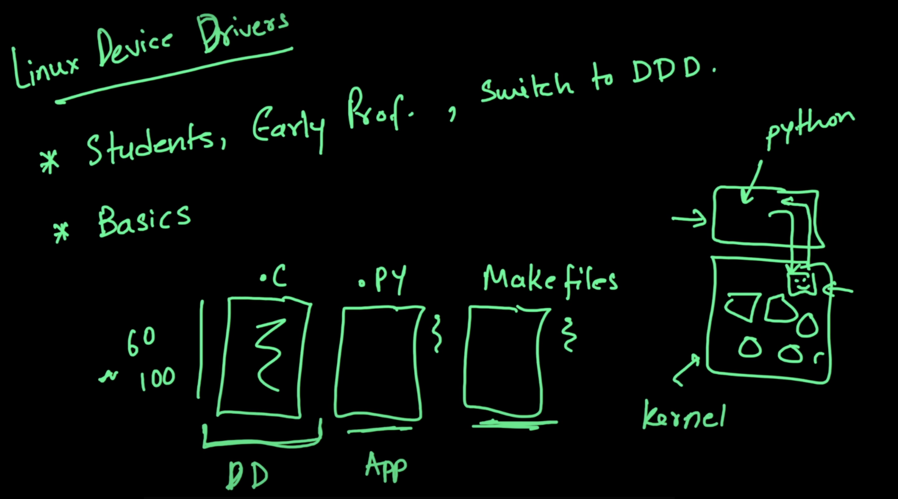
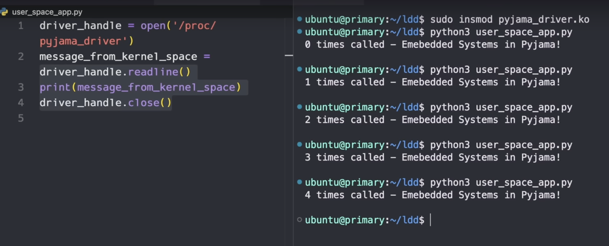

### Overview

- 3 particular files to code
  - `.C`
    - Has the code of the `new` device driver, we are building
    - This sits on top of the `kernel module`, as shown that houses other `device drivers`
  - `.py`
    - This is the `app` on top of the `kernel` (<kbd>as shown</kbd>) that, interacts with the newly built `device driver` i.e `makes a request` and gets the `response`
  - `makefile`
    - Builds and compiles the `device driver` file.

### Final Expected Result
