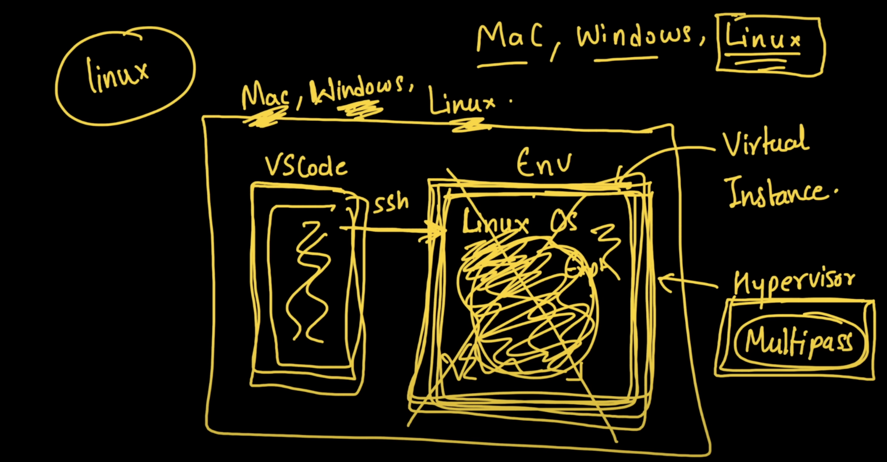
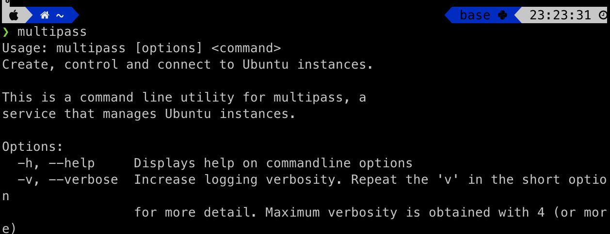
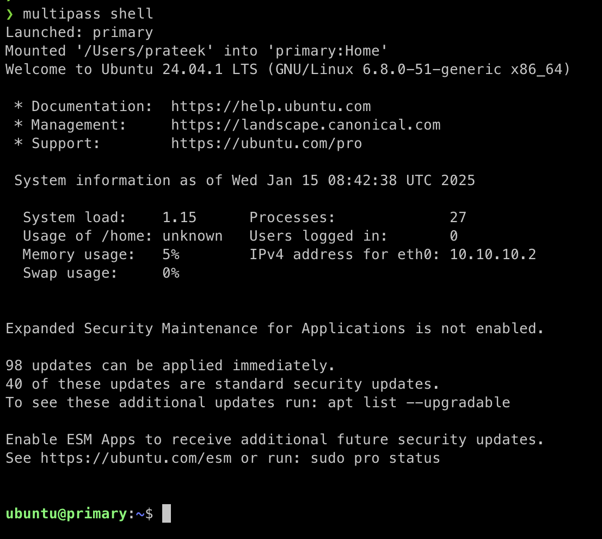

### Overview


- 3 particular files to code
  - `.C`
    - Has the code of the `new` device driver, we are building
    - This sits on top of the `kernel module`, as shown that houses other `device drivers`
  - `.py`
    - This is the `app` on top of the `kernel` (<kbd>as shown</kbd>) that, interacts with the newly built `device driver` i.e `makes a request` and gets the `response`
  - `makefile`
    - Builds and compiles the `device driver` file.

### Final Expected Result

- When we run the `user_space_app`, it interacts with the custom `device driver` file
and returns the `count` of number of times, the `driver` is called.


### Setting up the sandbox

- Idea/ Problem:
  - As per the fig, we have the host OS i.e `Mac` in my case, in case of Kernel/Device driver development, there's a chance, we screw up, the host OS.
  - Hence, we have the following solution.
- Solution
  - We need to create this, environment (i.e `Virtual Instance`) that has this `Linux OS`, as shown.
  - The `kernel space` iside this Linux OS, has multiple device drivers, where we add out `custom driver`
  - The software that runs this `hypervisor` is something called as `multipass`, which we want to install.
  - Finally, since this `env` is `command line dominant`, anmd we will work with `files`. while development, we connect this env, using `ssh` as shown.
  - We develop the project in `VS Code` after setting up `Remote Development` extension in VS, and update the files that are `remotely` present in the `hypervisor`. 

#### Setup of the env.

##### Install and verify `multipass`
```bash
brew install --cask multipass
```
- type `multipass` after installation complete.
  - 
  -  Verified!
  

##### We have the `hypervior i.e VM`, now we need the `primary instance i.e virtual instance`
```bash
multipass shell
```
  - This `downloads` some images, prepares the `instance` in the bg.
  - Based on inet speed, this gets donw in `5 min`
  - Verify the shell?
    - type `multipass`. If we see output, then correctly installed.
  
##### Now, we need to donwload and spin the `virtual instance` i.e `Linux OS`
- Run `multipass shell`
  - This downloads the `image` of instance and the instance is spun.
  - 

##### Setup `remote development` 
- install `extension` on VS code called `remote Explorer`
- It gives this icon `Computer/TV-like` named as `Remote Explorer`
- On the `ubuntu@primary` i.e primary shell on the VM, get the ip
  ```bash
  hostname -I
  ```
  - This ip, we need to paste in the `remote dev`, "+" icon as `ubuntu@<ip_copied>`
  - We also, need to set the:-
    - `keyboard` in the config file
      - `sudo vim /etc/ssh/sshd_config` -> set the line num `set nu` -> `Keyboard Auth`: yes  
      - `KbdInteractiveAuthentication yes`
    - set the `commandctl`
      - `sudo systemctl daemon-reload`
    - restart the ssh service
      - `sudo service ssh restart`
    - Finally, set the password.
      - `sudo passwd ubuntu`
  - [](./images/operations_ubuntu.png)

##### Verify the `ssh`
Modify something in `ubuntu@primary` and try to verify that in `ssh window of VS`
Verified!